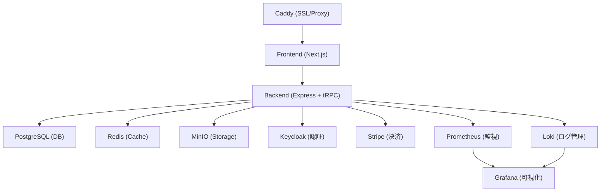

# アーキテクチャ設計

## システム構成図

## 各サービスの役割

- **Caddy**: SSL終端・リバースプロキシ
- **Frontend (Next.js)**: ユーザー向けWeb UI
- **Backend (Express + tRPC)**: APIサーバー・ビジネスロジック
- **PostgreSQL**: メインDB
- **Redis**: キャッシュ・セッション管理
- **MinIO**: ファイルストレージ
- **Keycloak**: 認証・認可
- **Stripe**: 決済処理
- **Prometheus/Grafana**: 監視・可視化
- **Loki**: ログ集約 