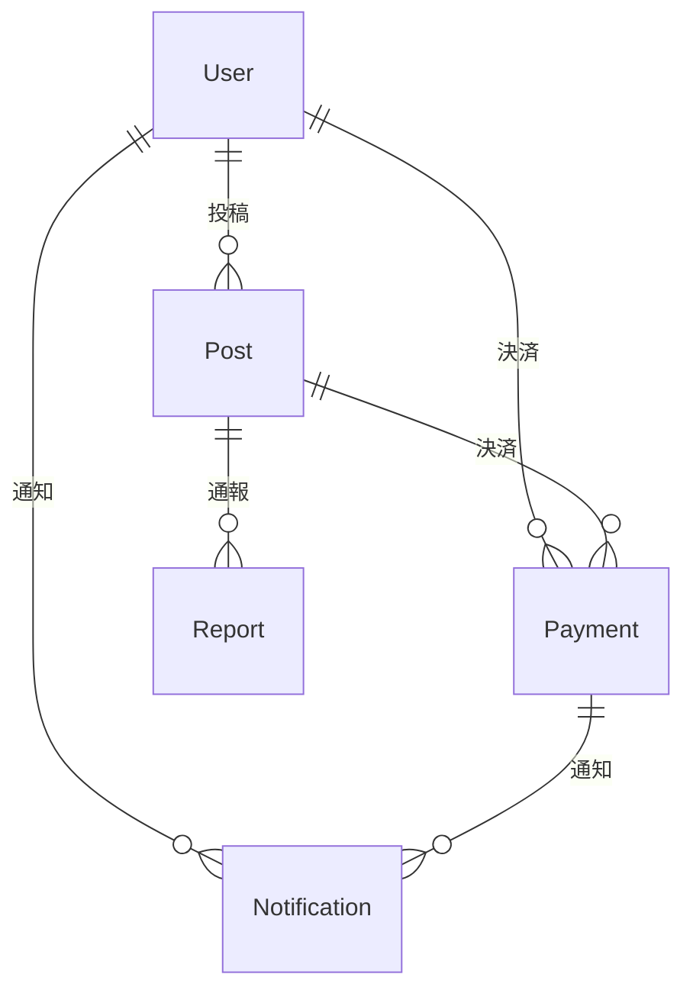

# データベースER図

## ER図（主要テーブル）

```mermaid
erDiagram
  User ||--o{ Post : "投稿"
  User ||--o{ Payment : "決済"
  User ||--o{ Notification : "通知"
  Post ||--o{ Payment : "決済"
  Post ||--o{ Report : "通報"
  Payment ||--o{ Notification : "通知"
```

## テーブル概要

- **User**: ユーザー情報
- **Post**: 案件・依頼投稿
- **Payment**: 決済情報
- **Notification**: 通知情報
- **Report**: 通報・モデレーション 