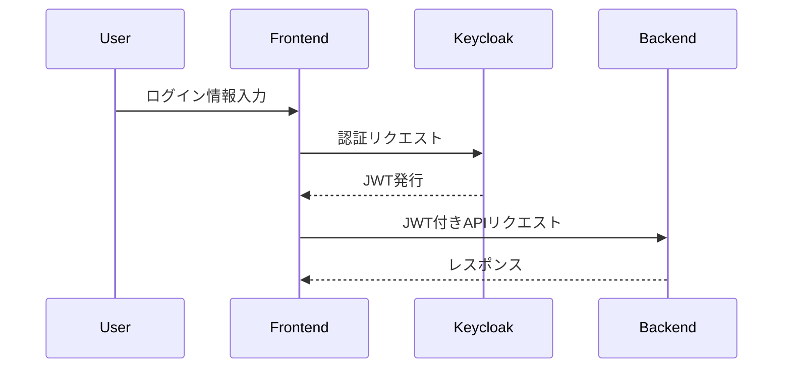
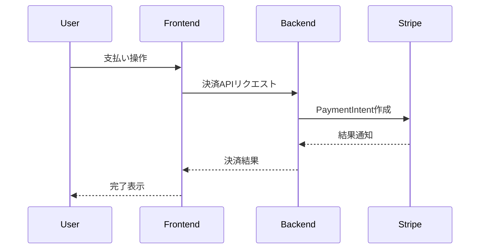
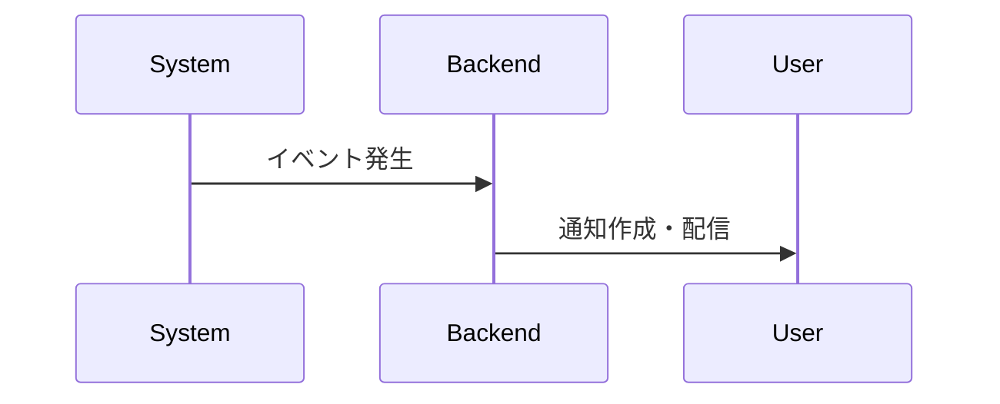

# 主要フロー図

## 認証フロー

```mermaid
sequenceDiagram
  participant User
  participant Frontend
  participant Keycloak
  participant Backend
  User->>Frontend: ログイン情報入力
  Frontend->>Keycloak: 認証リクエスト
  Keycloak-->>Frontend: JWT発行
  Frontend->>Backend: JWT付きAPIリクエスト
  Backend-->>Frontend: レスポンス
```

## 決済フロー

```mermaid
sequenceDiagram
  participant User
  participant Frontend
  participant Backend
  participant Stripe
  User->>Frontend: 支払い操作
  Frontend->>Backend: 決済APIリクエスト
  Backend->>Stripe: PaymentIntent作成
  Stripe-->>Backend: 結果通知
  Backend-->>Frontend: 決済結果
  Frontend-->>User: 完了表示
```

## 通知フロー

```mermaid
sequenceDiagram
  participant System
  participant Backend
  participant User
  System->>Backend: イベント発生
  Backend->>User: 通知作成・配信
``` 